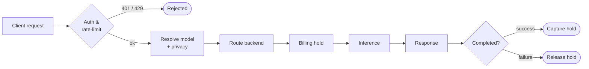

Nito sits between your application and a set of model providers. Your app sends one kind of request to one endpoint with one key. Nito decides which model and provider should serve it, enforces the privacy mode you asked for, places a billing hold, calls the provider, and streams or returns the result. This page builds that mental model carefully, because once it clicks, every other page in these docs is just a detail hung on this frame.

Read the [Request Lifecycle](#the-request-lifecycle) section below for a detailed step-by-step explanation of the request lifecycle in Nito.

## The Problem Nito Solves

Using AI models directly is more work than it looks. Each provider has its own account, its own API key, its own model names, its own request format, and its own stance on whether it keeps your data. If you want to use three providers, you manage three integrations and three bills, and you still have to trust each one's word about privacy. If you want to switch models for cost or quality, you often rewrite code.

A gateway removes that friction. A gateway is a single entry point that takes your request, decides which backend should handle it, applies your rules, handles payment, and returns the result in one consistent shape. Nito is that gateway, with one addition most gateways do not have: a privacy control on every single request, backed where it matters by hardware you can verify.

So the value is two-sided. Practically, you integrate once and reach many models. On privacy, you stop having to take a provider's word for it, because the strongest tiers give you a proof you can check yourself.

## The One-Sentence Version

You send a chat request familiar to OpenAI or Anthropic to Nito; the model ID specified in the request selects both the model and how private the call is; Nito routes, bills, and runs it; and for the highest tiers it gives you an attestation (a signed statement about the sealed environment that ran your call) that you can verify independently.

The most important concept here: **the model ID carries two decisions at once**, which model to use and the privacy level. That is the hinge the whole product turns on, and is explained in the section below.

## The Request Lifecycle



Here is what actually happens step-by-step behind the scenes when a user makes a call. The user usually only ever performs the steps 1 and 2 directly; the rest is the gateway doing its job, however, knowing them helps you reason about errors, cost, and latency.

<Steps>
  <Step title="Authentication" icon="1" iconType="solid" stepNumber={1} titleSize="h4">
    You send your API key as a bearer token in the `Authorization` header. Nito looks it up, resolves it to your organization (the account that owns billing and keys), and rejects the request with `401` if the key is missing, malformed, revoked, or expired. This is also where rate limits are checked: if you are over a limit, you get `429` with a `Retry-After` header telling you how long to wait.
  </Step>
  <Step title="Model and privacy resolution" iconType="solid" stepNumber={2} titleSize="h4">
    Nito reads the `model` field. The base part selects the model; an optional suffix selects a stronger privacy mode. For example, `x-ai/grok-4.5` is ordinary mode; on a TEE-capable model, a suffix asks for a stronger mode, so `openai/gpt-oss-120b:confidential` asks for execution inside a Trusted Execution Environment and `openai/gpt-oss-120b:encrypted` asks for end-to-end encrypted TEE. Only `:confidential` and `:encrypted` are valid suffixes, and the chosen model must actually support the mode you ask for, or the call is rejected rather than quietly downgraded. This refusal-to-downgrade is deliberate: a privacy guarantee that silently weakens is worse than no guarantee.
  </Step>
  <Step title="Routing" icon="3" iconType="solid" stepNumber={3} titleSize="h4">
    A single logical model can be served by more than one physical backend (the same model at different providers, or at different privacy tiers). Nito gathers the eligible backends and chooses one, filtering first by hard requirements (your privacy mode, the features you asked for, the inputs you sent) and then ordering what remains by availability and cost. The result is that you name one model and Nito quietly picks a healthy, eligible, cost-effective backend to run it.
  </Step>
  <Step title="Billing Hold" icon="4" iconType="solid" stepNumber={4} titleSize="h4">
    Before spending real money on a provider call, Nito places a hold against your credit balance, sized to the expected cost of the request. A hold is like the pre-authorization a hotel puts on a card at check-in: it reserves the funds without charging them yet. This guarantees user can pay for the work before it starts.
  </Step>
  <Step title="Inference" icon="5" iconType="solid" stepNumber={5} titleSize="h4">
    Nito calls the chosen provider inside the privacy boundary you selected, and returns the result either as one complete response or as a stream of tokens (small incremental pieces) over a long-lived connection.
  </Step>
  <Step title="Settlement" iconType="solid" stepNumber={6} titleSize="h4">
    When the call succeeds, the hold is captured for the actual usage (which may be less than the estimate). If the request fails before producing any usage, the hold is released and you are not charged. This is why a failed call does not cost you credits, and it is a direct consequence of the hold-then-settle design in step 4.
  </Step>
</Steps>

A useful way to remember the lifecycle: **authenticate, resolve, route, hold, run, settle.** Two of those (resolve and run) are shaped by the single `model` string you send.

## One Key, Many Models

A single API key reaches the entire catalog. You do not hold accounts with the underlying providers (xAI, OpenRouter, NEAR, Phala, and an image provider), and you never touch their keys. From your side there is one credential, one base URL, one bill.

To see what is available, ask the gateway:

```bash
curl https://nito.dev.zprotocol.org/v1/models \
  -H "Authorization: Bearer $NITO_API_KEY"
```

Each entry includes the model `id` you pass back in a request, its `type` (chat, image), its `capabilities` (which features it supports), and its `privacy_tier`. One detail matters for how you write code: **the catalog is discovered from providers and kept current, not hard-coded.** Models are added and retired over time. So treat `GET /v1/models` as the live source of truth and select models by capability at runtime, rather than pasting a model name into your source and hoping it still exists next quarter.

## Selectable Privacy Per Call

This is the part that makes Nito different. On most AI platforms, privacy is a property of your account or your plan: you sign up for a tier and every request inherits it. On Nito, privacy is a property of **each request**, and you choose it with the model ID. The same key, in the same app, can send a throwaway request in ordinary mode and a highly sensitive request inside a sealed, attested environment, with the only difference being a suffix on the model name.

| You send | Privacy mode | What it means in plain terms |
| --- | --- | --- |
| `model-id` | Ordinary | Standard routing. By default the gateway keeps metadata only, not your prompt or the model's reply. |
| `model-id` (a private-tier model) | Private | Served by a privately configured backend with zero-data-retention enforced at the provider, so the upstream is contractually and technically told not to keep the data. |
| `model-id:confidential` | TEE | Runs inside a Trusted Execution Environment: a hardware-isolated, sealed compute box the host cannot peer into. You can fetch an attestation and verify the call really ran there. |
| `model-id:encrypted` | End-to-end encrypted TEE | Adds client-side encryption on top of TEE, so the data is encrypted to the sealed environment itself. The strongest mode. It does not stream and supports fewer features, by design. |

**Why offer a dial instead of just maxing out privacy?** Because the strongest modes have real trade-offs. End-to-end encrypted TEE cannot stream, so a chat UI built on it cannot show tokens as they arrive. TEE-capable backends are fewer, which can mean higher latency or lower availability. Forcing every request through the strongest mode would make routine calls slower and more fragile for no benefit. Letting you match the protection to the sensitivity of each call is the whole point: pay the cost of strong privacy only where the request actually needs it.

Which modes a given model supports is reported on its catalog entry (look at `privacy_tier`, `attestation_available`, and `encrypted_supported`). Confidential and Encrypted come from specific providers only. The full treatment is in [Per-call privacy modes](/privacy/per-call-privacy-modes) and [Privacy tiers in depth](/privacy/tiers).

<Warning>
  Privacy modes are selected by the model ID suffix, and the only valid suffixes are `:confidential` and `:encrypted`. Any other suffix (`:standard`, `:zdr`, `:private`, and so on) is rejected. There is no separate `tier` field in the request body. If you want a different privacy mode, you change the model string, nothing else.
</Warning>

## What You Can Do With One Request

The same gateway, one key, covers a wide surface. Each of these has its own page under [Features](/features), but they all ride on the routing, billing, and privacy model above:

- **Chat and text generation** the primary surface, OpenAI-compatible.
- **Embeddings** vectors for search and retrieval, with the same privacy options as chat.
- **Image generation** text-to-image from a prompt.
- **Server-side tools** web search and web fetch the model can use mid-generation, executed by Nito so you do not wire them up yourself.
- **File parsing** extract text from PDFs and office documents to feed into a prompt.
- **Reasoning** ask a capable model to think step by step, with controls over how much effort it spends.

## What Nito Does Not Do For You

Knowing the boundaries prevents wrong assumptions:

- **Nito does not execute your own custom function tools.** If you define a function tool, the model can ask to call it, but your code runs it and sends the result back, exactly like the OpenAI tool-calling loop. Nito routes the conversation; it does not run your functions.
- **Nito does not keep your conversation history by default.** Where a chat history exists (for example in a browser app), it is stored on the client side. The gateway's default posture is metadata only. See the [Privacy overview](/privacy/overview) section for the precise contract.
- **Nito is not a single model.** There is no "Nito model." You always name a model from the catalog.

## Common Issues

- **"I set privacy once for my account."** No. Privacy is per request, via the model ID. Two calls with the same key can use different modes.
- **"`:confidential` will fall back to a normal backend if no TEE is free."** No. A privacy mode never silently downgrades. If it cannot be served as asked, the call fails.
- **"A logical model always runs on the same backend."** No. Routing can pick different backends across calls based on availability and cost. For attested calls, the attestation tells you exactly where it ran.

## Next Steps

<CardGroup cols={3}>
  <Card title="Quickstart to making calls" icon="play" href="/get-started/quickstart-60-seconds">
    A step-by-step quickstart guide to getting started.
  </Card>

  <Card title="Understand Authentication Keys First" icon="gear" href="/get-started/authentication">
    Understand how the authentication keys work.
  </Card>

  <Card title="Privacy Overview" icon="shield-halved" href="/privacy/overview">
    Go deep into the privacy tiers and attestation work.
  </Card>
</CardGroup>