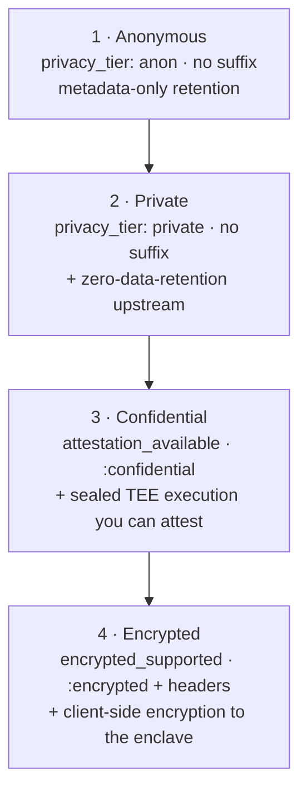

Nito lets you choose how private each call is, and you make that choice per request rather than once for your whole account. The brief version lives in [Privacy tiers at a glance](/models/privacy-tiers-at-a-glance). This section is the authoritative reference: one page per tier, going deeper into what each one protects, how you select it, and the trade-offs you accept when you pick it.

## Each tier builds on the last

Read the four tiers as a ladder. Each rung adds a stronger guarantee and, in exchange, narrows the set of models and features available to you. You climb only as high as a given call needs.

| Tier | `privacy_tier` | Select with | Core guarantee it adds |
| :--- | :---: | :--- | :--- |
| **Anonymous** | `anon` | plain model ID | Metadata-only retention by default |
| **Private** | `private` | plain model ID · private-tier | Zero-data-retention enforced upstream |
| **Confidential** | `confidential` | `model:confidential` | Sealed TEE execution with a verifiable attestation |
| **Encrypted** | `encrypted` | `model:encrypted` + headers | Client-side encryption to the sealed enclave |

Each higher tier keeps the guarantees of the ones below it and adds its own. Confidential runs inside a Trusted Execution Environment that you can attest; Encrypted keeps that sealed execution and additionally encrypts your data to it.

## On the names

The four tiers — Anonymous, Private, Confidential, Encrypted — are the canonical `privacy_tier` values in the catalog. The model-ID suffix is the real selector:

- **No suffix** selects the model's stored tier, either `anon` (Anonymous) or `private` (Private).
- **`:confidential`** selects Confidential.
- **`:encrypted`** selects Encrypted.

`:confidential` and `:encrypted` are the canonical suffixes. There is no separate `tier` field in the request body; you change the privacy of a call by changing the model string, nothing else.

## Which tiers a model offers

No model supports every tier. Which rungs of the ladder a given model offers is reported on its catalog entry from `GET /v1/models`, and the practical rule is always the same: read the model entry, then choose the tier the model supports.

- **Anonymous / Private** are decided by the model's `privacy_tier` field (`anon` or `private`). You do not add a suffix; the model's own tier determines which of the two you get.
- **Confidential** is available when the entry shows `attestation_available: true` (with `privacy_tier: "confidential"`). Select it with `:confidential`.
- **Encrypted** is available when the entry shows `encrypted_supported: true`. Select it with `:encrypted` and the required encryption headers.

A privacy mode never silently downgrades. If you append `:confidential` to a model that has no TEE backend, the call is rejected rather than served at a weaker tier. A guarantee that quietly weakens is worse than no guarantee, so the gateway refuses instead.

_Each rung keeps the guarantees of the rungs below it and adds its own. Support is decided per model — read `privacy_tier`, `attestation_available`, and `encrypted_supported` on the catalog entry, then choose the tier the model offers._

## How to read the rest of this section

Start with the tier closest to your need and climb from there:

- [**Anonymous**](/privacy/tiers/anonymous) the lightest tier and the default. Broad model availability, metadata-only retention.
- [**Private**](/privacy/tiers/private) privately served models with no upstream retention.
- [**Confidential**](/privacy/tiers/confidential) sealed execution with an attestation you can fetch and verify. Supports streaming.
- [**Encrypted**](/privacy/tiers/encrypted) the top rung: client-side encryption to the sealed environment, with the most constraints.

## Related

- [Privacy tiers at a glance](/models/privacy-tiers-at-a-glance)
- [Privacy overview](/privacy/overview)
- [Per-call privacy modes](/privacy/per-call-privacy-modes)
- [TEE attestation](/privacy/tee-attestation)
- [Model ID convention](/models/model-id-convention)
- [How Nito works](/get-started/how-nito-works)
